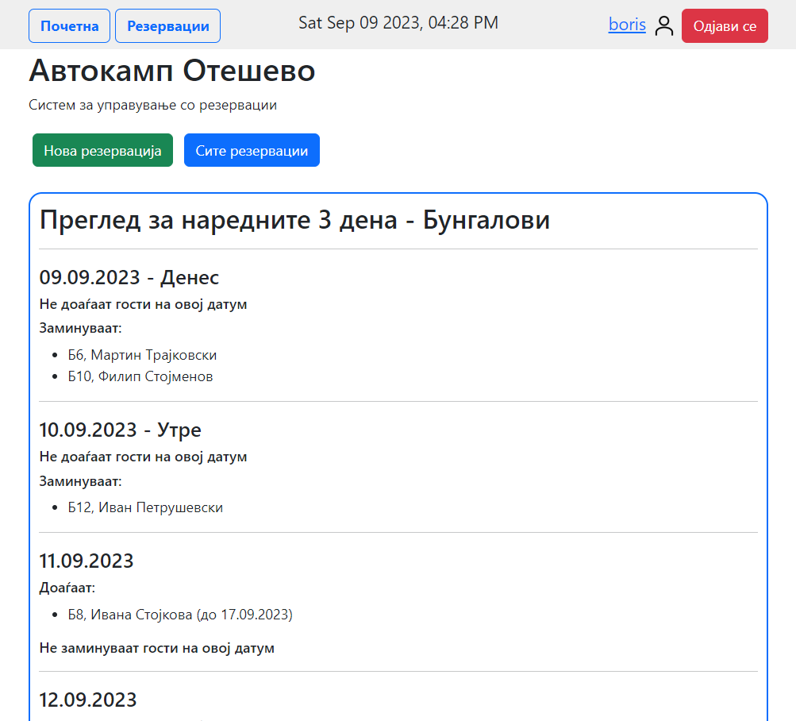
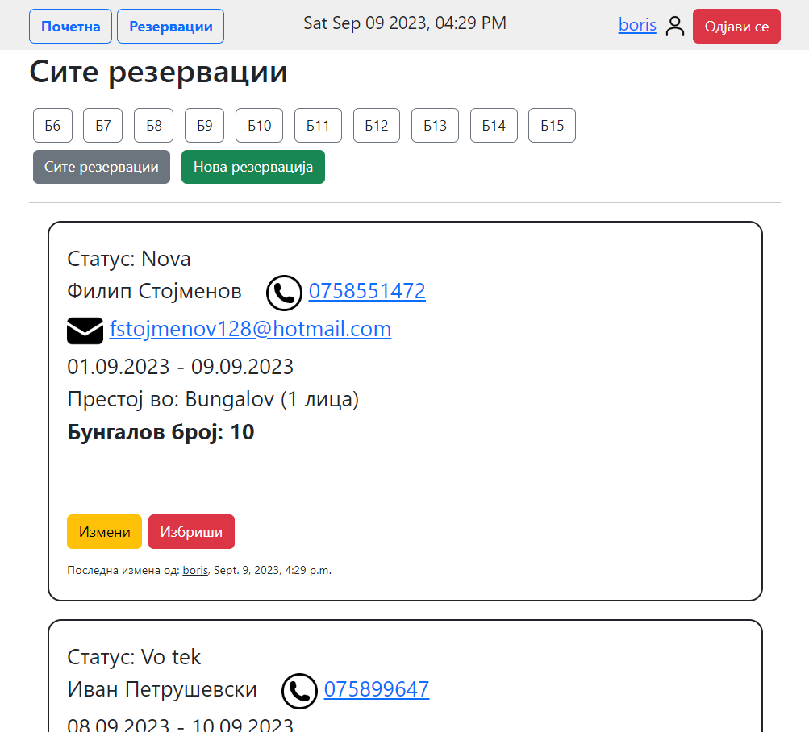

<br/>
<p align="center">
  <a href="https://github.com/stojchevskiboris/reservations">
    
  </a>

  <h3 align="center">Reservations Web-App</h3>

  <p align="center">
    An Easy way too keep track of your reservations.
    <br/>
    <br/>
    <a href="https://www.djangoproject.com/"><strong>Explore the docs »</strong></a>
    <br/>
    <br/>
    <a href="https://otesevo.pythonanywhere.com/"><strong>Open Web-App »</strong></a>
  </p>
</p>

    

## About The Project





## Built With

This project was built with <a href='https://www.djangoproject.com/'>Django Framework</a> (4.2), based on <a href='https://www.python.org/'>Python 3.10</a>.
Also using in project:
<ul>
  <li><a href='https://getbootstrap.com/'>Bootstrap</a></li>
  <li><a href='https://jquery.com/'>jQuery</a></li>
</ul>

## Getting Started

### Prerequisites
To set up this project, you need to have Python 3.10 and Django 4.2 installed on your machine. The rest of the scripts and stylesheets are embedded. 

### Installation

1. Clone the repo

```sh
git clone https://github.com/stojchevskiboris/reservations.git
```
2. navigate to root folder

3. run the project
```sh
py manage.py runserver 
```


## Authors

* **Boris Stojchevski** - *Comp Sci Student* - [Boris Stojchevski](https://github.com/stojchevskiboris/)
